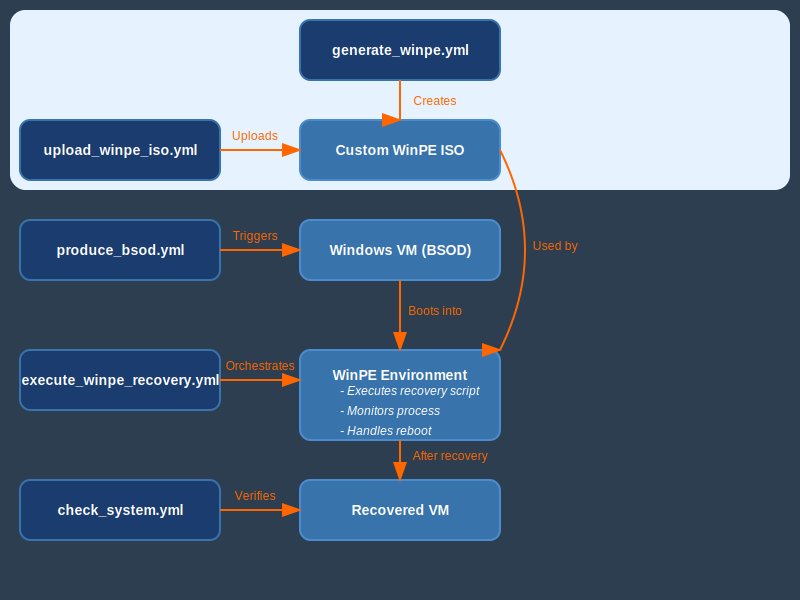

# Ansible Windows 0-Day Blue Screen of Death (BSoD) Recovery

This Ansible project provides automation for handling and recovering from Blue Screen of Death (BSoD) scenarios in Windows environments similar to those experienced during the [2024 Crowdstrike incident](https://en.wikipedia.org/wiki/2024_CrowdStrike_incident). It's designed to work with both VMware and OpenShift Virtualization (KubeVirt) platforms.

## Project Overview

The project consists of several playbooks and roles that allow you to:

1. Generate a Windows Preinstallation Environment (WinPE) ISO
2. Upload the WinPE ISO to your virtualization platform
3. Simulate a BSoD scenario
4. Boot a problematic VM into WinPE
5. Apply fixes to recover from the BSoD

### Ansible Automation Platform - Windows 0-Day BSoD Recovery (VMware vSphere)

https://github.com/user-attachments/assets/58c25289-00c6-4175-bd14-412b436eb5e4

### Ansible Automation Platform - Windows 0-Day BSoD Recovery (OpenShift Virtualization)

## Architecture and Workflow

The following diagram illustrates the high-level architecture and workflow of the BSoD recovery process:

## How to Use

1. Clone this repository to your local machine or Ansible control node.
2. Ensure you have Ansible installed (version 2.9 or higher recommended).
3. Install required collections: `ansible-galaxy collection install -r collections/requirements.yml`
4. Install required roles: `ansible-galaxy role install -r roles/requirements.yml`
5. Modify the `group_vars/all.yml` file to match your environment settings.
6. Choose the appropriate playbook for your scenario and run it using `ansible-playbook`.

## Scenarios and Playbooks

### Scenario 1: Generate and Upload WinPE

- `generate_winpe.yml`: Creates a custom WinPE ISO with recovery scripts. This is where the specific fix (e.g., for CrowdStrike-like issues or other BSoD scenarios) is embedded.
- `upload_winpe_iso.yml`: Uploads the generated WinPE ISO to the virtualization platform.

### Scenario 2: Simulate BSoD and Recovery

- `produce_bsod.yml`: Triggers a simulated BSoD on target Windows VMs.
- `execute_winpe_recovery.yml`: Boots the VM into WinPE and executes the embedded recovery script.
- `check_system.yml`: Performs a health check on the Windows systems after recovery.

## Project Background and Workflow

This project was inspired by the [2024 CrowdStrike incident](https://en.wikipedia.org/wiki/2024_CrowdStrike_incident), where a widespread BSoD issue affected numerous Windows systems. However, the project's scope extends beyond this single incident, providing a framework for automating recovery from various BSoD scenarios.

The workflow is designed as follows:

1. **WinPE Generation**: The `generate_winpe.yml` playbook creates a custom WinPE ISO. This ISO includes specific scripts tailored to address particular BSoD scenarios, such as the CrowdStrike-like issue or other common BSoD causes. The recovery logic is embedded within this ISO.

2. **Recovery Execution**: The `execute_winpe_recovery.yml` playbook is a generic orchestrator. It's responsible for:
   - Booting the affected VM into the custom WinPE environment
   - Initiating the embedded recovery script
   - Monitoring the recovery process
   - Handling the VM reboot after successful recovery

This design allows for great flexibility:

- To address different BSoD scenarios, you only need to modify the recovery script embedded in the WinPE ISO during the generation phase.
- The execution playbook remains consistent across various BSoD types, providing a unified interface for recovery operations.

By separating the specific recovery logic (in the WinPE ISO) from the execution process, this project offers a scalable and adaptable solution for automated Windows system recovery.

## Importing to Ansible Automation Platform (AAP)

To import this project into AAP:

1. Ensure you have access to an AAP instance.
2. Modify the `setup_demo.yml` playbook to match your AAP environment settings.
3. Run the `setup_demo.yml` playbook. This playbook will:
   - Create necessary inventories
   - Set up job templates
   - Configure projects
   - Set up workflows
4. Once imported, you can access and run the workflow templates from the AAP web interface.

## Project Structure

- `roles/`: Contains custom roles for WinPE creation, VM operations, and BSoD fixes.
- `group_vars/`: Stores common variables for the project.
- `node-config/`: Contains node-specific configurations for different scenarios.
- `collections/`: Lists required Ansible collections.
- `aap_config/`: Holds AAP-specific configuration files.

**Note:** This project is for demonstration purposes only and should not be used in production environments without proper testing and validation.
